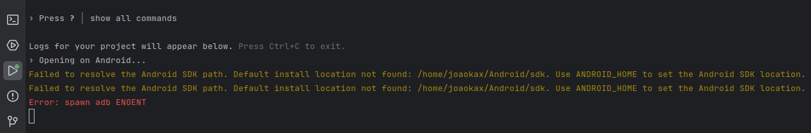

---
hide:
  - toc
---

# 🤖 Errors when running Android

### Failed to resolve the Android SDK path



When trying to run the emulator through the IDE and encountering this error, check whether the variables in your **.bashrc** or **.zshrc** file:

```bash
nano .zshrc
```

```bash
nano .bashrc
```

.png)

```bash
export ANDROID_HOME=$HOME/Android/Sdk
export PATH=$PATH:$ANDROID_HOME/emulator
export PATH=$PATH:$ANDROID_HOME/platform-tools
```

If it still doesn't work, don't run the emulator through the IDE, but through the terminal:

```bash
npx expo start
```

