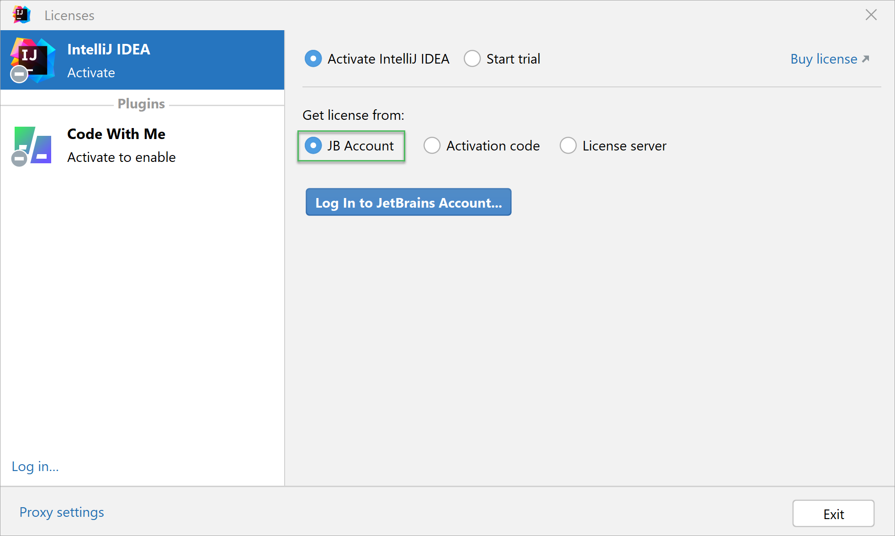
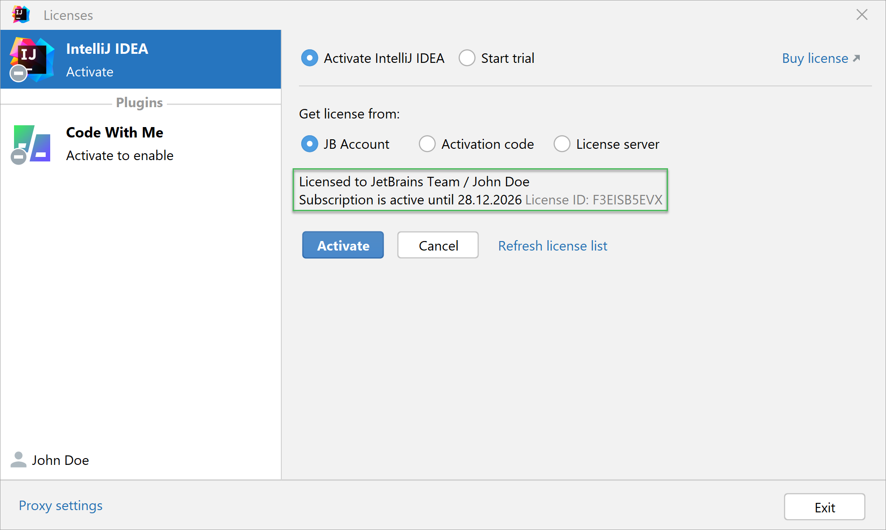

---
hide:
  - toc
---

# Quer sair da ilegalidade e ter o Ruby Mine ativado? Então segue o acesso!


!!! warning "ATENÇÃO"
    Respeite os dados do coleguinha, não os copie! após acessar, tenha certeza de mante-los somente nesta documentação, evitando problemas de segurança da conta.

#### EMAIL
```
{{EMAIL_RUBYMINE}}
```

#### SENHA
```
{{SENHA_RUBYMINE}}
```

---

## Não sabe como acessar? Siga os passos!

1. Abra a IDE
2. Abra o menu de Licenças indo em HELP -> REGISTER
3. Faça o log in utilizando a conta da Jetbrains, mantendo a licença no modo 'JB Account'
{ width=900 }
4. Confirme que tudo deu certo vendo se a licença está ativa
{ width=900 }
