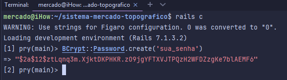

---
hide:
  - toc
---

# Quer gerar uma nova senha diretamente no banco? Vamos nessa!
Seguindo os passos abaixo, você irá obter uma senha 'digested' para você substituir no banco sem dor de cabeça.

- O comando para acessar o Rails console é:
```bash
rails console  # pode ser abreviado para 'rails c'
```

- Já dentro do Console, executaremos o seguinte comando
```bash
# Já dentro do Rails Console
BCrypt::Password.create('sua_senha')  # Substitua pela senha que deseja hashear
```

## É isso, simples e prático! Você terá um resultado como este a seguir:

